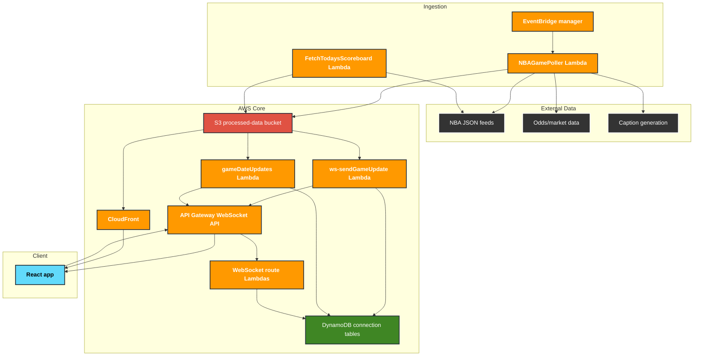

# [MinutesMap](https://minutesmap.com) 🏀

**Interactive live basketball play-by-play visualization.**

  
 

[Launch Live App](https://minutesmap.com)


## Introduction

MinutesMap is built around a dense, interactive play-by-play visualization for following NBA games in a way a standard play-by-play log cannot show. The core view maps game events over time so scoring runs, player stretches, lineup changes, stat filters, and win/odds movement can be inspected together.

Score state, boxscore detail, lineup/minute views, schedule navigation, and export tools support that central play-by-play surface.

The app runs on a serverless AWS architecture and uses a hybrid push/pull real-time pattern:

- WebSockets notify clients when game or schedule data changed.
- Clients fetch the latest JSON from CloudFront-backed S3 paths.
- The poller writes compressed gamepack and schedule artifacts that are cheap to serve and cache.

## Architecture And Data Flow



### Main Components

- **Frontend:** Vite + React static app served from S3 through CloudFront.
- **Primary data artifacts:** compressed JSON under `data/gamepack/*.json.gz` for game state and `schedule/YYYY-MM-DD.json.gz` for daily schedules.
- **Page artifacts:** generated team/player data under `data/pages/` for derived views and navigation surfaces.
- **Realtime layer:** API Gateway WebSocket API with Lambda routes for `followDate`, `followGame`, `unfollowDate`, and `unfollowGame`.
- **Connection state:** DynamoDB tables for game subscriptions and date subscriptions.
- **Ingestion:** Python `NBAGamePoller` Lambda manages schedule reconciliation, live game polling, gamepack uploads, page artifact updates, optional captions, and poller scheduling.
- **Utility jobs:** scripts in `jobs/` support backfills, repairs, manifest rebuilds, page artifact builds, and one-off processing.

## Data Model

The frontend bootstraps from `data/init.json`, loads the selected date's schedule from `schedule/<date>.json.gz`, and loads game detail from `data/gamepack/<game-key>.json.gz`.

Gamepack payloads combine the current boxscore and processed play flow, including normalized teams, players, lineup segments, last action, period metadata, odds data when available, and generated captions when available. The client adapts older and newer payload shapes in `front/src/data/` so stored artifacts can evolve without forcing large UI rewrites.

When a gamepack changes, S3 invokes `ws-sendGameUpdate-handler`, which finds WebSocket connections subscribed to that game and sends a small message containing the changed key and version. The browser then fetches the fresh CloudFront URL. Schedule updates follow the same pattern through `gameDateUpdates` and date subscriptions.

## Play-By-Play Visualization

- Dense timeline of game events, scoring flow, player actions, and period context.
- Interactive inspection with hover/pointer state and focused player detail.
- Stat filters for isolating specific event types and player contributions.
- Score differential and odds overlays for reading momentum alongside the event stream.
- Export rendering for sharing selected play views.

## Supporting Features

- Schedule/date selection with URL state.
- Live score, status, and last-action summary.
- Player detail and lineup/minute views.
- Boxscore panel with stale-while-loading behavior for live refreshes.
- Dark mode and responsive layout.
- Static `about` and `privacy` pages generated during the frontend build.

## Repository Structure

| Directory | Description |
| --- | --- |
| `front/` | Vite + React app, component/domain/data modules, Vitest tests, Playwright E2E tests, static page generator, and frontend deployment scripts. |
| `functions/` | AWS Lambda code in Python and TypeScript, shared Lambda helpers, pytest tests, Vitest tests, and generated JS bundles for TypeScript Lambdas. |
| `jobs/` | Local utility and backfill scripts for schedules, gamepacks, player IDs, page artifacts, and manifests. Some scripts can write to AWS when run with upload/write flags. |
| `terraform/` | AWS infrastructure: S3, CloudFront, DynamoDB, API Gateway WebSockets, Lambdas, IAM, EventBridge, and scheduler wiring. |
| `docs/` | Repository images and supporting documentation assets. |

## Testing

Targeted checks are usually enough before broader suites:

```bash
npm --prefix front run test:unit
npm --prefix front test -- --list
npm --prefix front test -- e2e/app.spec.js --project=chromium -g "<pattern>"
npm --prefix functions run test
source functions/.venv/bin/activate && python -m pytest -q functions/tests/test_nba_game_poller_processing.py
python -m pytest -q jobs/tests
```

See `front/TESTING.md` for frontend test placement, impact mapping, and preferred commands.

## Infrastructure

Terraform in `terraform/` manages:

- S3 buckets for frontend hosting and processed data.
- CloudFront distribution, SPA rewrites, and data path routing.
- DynamoDB tables for game and date WebSocket subscriptions.
- API Gateway WebSocket API and Lambda integrations.
- Python and TypeScript Lambda functions for polling, schedule updates, WebSocket routes, and update broadcasts.
- EventBridge rules and Scheduler roles for daily management, live polling, and reconciliation.
- IAM roles and policies for each Lambda.

Typical validation flow:

```bash
terraform -chdir=terraform fmt
terraform -chdir=terraform validate
```

After the frontend response headers policy has deployed and CloudFront has propagated it, verify
the production headers with:

```bash
npm --prefix front run check:security-headers -- \
  https://minutesmap.com/ \
  https://minutesmap.com/about/ \
  https://minutesmap.com/privacy/ \
  https://minutesmap.com/theme-init.js
```

The CSP is enforced. Scripts are limited to same-origin bundles and the analytics host; it does not
allow `unsafe-inline` or `unsafe-eval`. Runtime React/Emotion styles still require the narrower
`style-src 'unsafe-inline'` exception. Blob URLs are allowed only for generated image previews, and
WebSocket connections are limited to the Terraform-managed API Gateway origin.

Deployments are handled by GitHub Actions on `main`. Running `terraform apply`, frontend S3 syncs, or job upload/write commands can modify production infrastructure or data, so treat them as explicit deployment operations.

## CI/CD

### Frontend Deploy (`frontend.yml`)

Triggered by pushes to `main` that touch `front/**`.

- Installs frontend dependencies with `npm ci`.
- Runs ESLint, Prettier check, Vitest unit tests, and an informational coverage report.
- Runs Playwright Chromium smoke tests in the Playwright container.
- Builds the app with static page generation.
- Syncs built assets to S3 and invalidates CloudFront.

### Backend & Infra (`infra.yml`)

Triggered by pushes to `main` that touch `terraform/**` or `functions/**`.

- Installs Lambda Node dependencies.
- Installs Python test dependencies.
- Runs Vitest for TypeScript Lambda/shared code.
- Runs pytest for Python Lambda code.
- Builds TypeScript Lambda bundles.
- Runs `terraform init` and `terraform apply -auto-approve` with deployment secrets from GitHub Actions.

## Generated Artifacts

Do not hand-edit generated Lambda bundles:

- `functions/gameDateUpdates/lambda_function.js`
- `functions/ws-sendGameUpdate-handler/lambda_function.js`

Regenerate them after changing the corresponding `.ts` sources:

```bash
npm --prefix functions run build:lambdas
```

The frontend build also generates `front/public/about/index.html`, `front/public/privacy/index.html`, and static-page assets from `front/static-pages/`.
